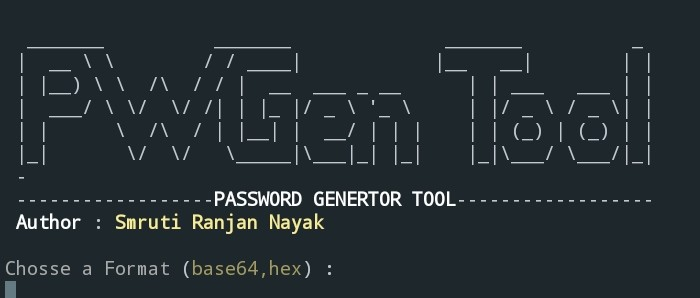

# PWGenTool
This is a simple Password Generator Tool.  USE Openssl (base64 & Hex).

</img>

# installation Setup for Termux

1)pkg install git

2)pkg install openssl-tool

3)git clone https://github.com/SmrutiRN/PWGenTool.git

4)cd PWGenTool

5)chmod 777 PWGen.sh

6)bash PWGen.sh or ./PWGen.sh

# Video :

https://www.youtube.com/embed/lGL0ClwKBAA
